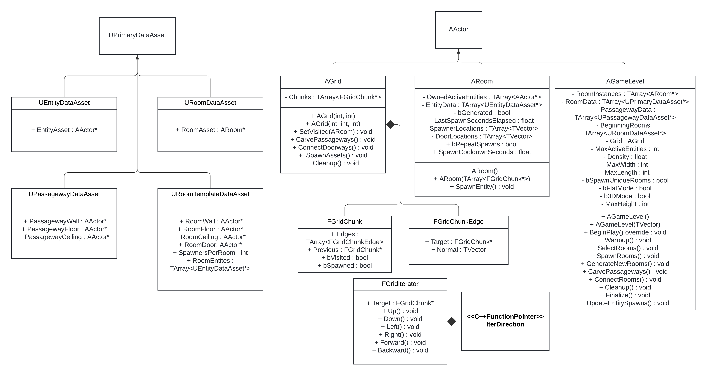

# SimpleLevelGenerator
---
## How to Use:
This asset is designed to be expanded upon on a project to project basis for specific uses.
This asset generates its own rooms; however, this asset can incorperate premade room assets*.

#### &nbsp; Getting Started 
- Find SimpleLevelGenerator on fab.com
- Add it to an Unreal Project

#### &nbsp; Setup
- Create a new Blueprint from AGameLevel
- Configure values in the details panel
- Optional: Add custom data to spawn custom rooms*
Note: Entities do not spawn if no Entity data is provided.

#### &nbsp; Lastly
- Add the new Blueprint to the scene
Note: spawns game level at runtime if `boolean` is true.

#### &nbsp; *Customization
- __Custom Rooms__: create new instances of URoomDataAsset
and add them to the RoomData in the AGameLevel Blueprint.
Important Note: Custom Room Meshes require placed door and spawner sockets. (*Refer to Sockets*)

- __Custom Entities__: create new instances of UEntityDataAsset,
initialize variables of each instance. Add references to the
entity assets to the EntityData array in each ARoom blueprint.

- __Custom Passageways__: create instance(s) of UPassagewayDataAsset,
initialize variables of each instance. Add reference(s) to PassagewayData in the AGameLevel Blueprint.

- __Custom Spawn Room__: create instance(s) of URoomDataAsset,
initialize RoomAsset variable with a premade Spawn Room.
Note: This assumes the Spawn Room has a Player Start Location already placed.

- __Custom Entry Points__: construct a new AGameLevel using it's overloaded TVector constructor.
Important Note: will place a room from BeginningRooms if entry socket is provided. (*Refer to Sockets*)

- __Room and Entity functionality expansion__: add new variables to 
URoomDataAsset and UEntityDataAsset to expand data needed for generating
new Rooms/Entities. To edit functionality, alter the C++ classes directly, 
or add functionality to a blueprint created from either class.

## Sockets:
All Custom Rooms used by SimpleLevelGenerator must have custom sockets attached to its mesh indicating doorways and spawn locations.
**Beginning Rooms require an entry socket to represent the position to align the open entrance doorway.**
#__Socket Naming Conventions__
Note: Case Sensitive
- *Spawners*: include "spawnersocket" anywhere in the name of the socket.
- *Doorways*: include "doorwaysocket" anywhere in the name of the socket.
- *Entry*: include "entrysocket" anywhere in the name of the socket.

## Classes:

####  &nbsp; &nbsp; &nbsp; Table of Contents
- [UEntityDataAsset](#class-uentitydataasset-udataasset)
- [URoomDataAsset](#class-uroomdataasset-udataasset)
- [URoomTemplateDataAsset](#class-uroomtemplatedataasset)
- [ARoom](#class-aroom-aactor)
- [AGrid](#class-agrid-aactor)
- [FGridChunk](#struct-fgridchunk)
- [FGridChunkEdge](#struct-fgridchunkedge)
- [FGridIterator](#struct-fgriditerator)
- [AGameLevel](#class-agamelevel-aactor)

#### class UEntityDataAsset : UDataAsset 
> Stores data related to spawning Entities into the scene. (Expandable)

| Variable                                 | Use                                                                  |
|:-----------------------------------------|:---------------------------------------------------------------------|
| AActor* EntityAsset | Stores an Actor asset to be spawned into the level. |

#### class URoomDataAsset : UDataAsset
> Stores data related to spawning premade Rooms into the scene. (Expandable)

| Variable                                 | Use                                                                  |
|:-----------------------------------------|:---------------------------------------------------------------------|
| ARoom* RoomAsset | Stores a Room to be spawned into the level. |

#### class URoomTemplateDataAsset : UDataAsset
> Stores data related to generating Rooms into the scene. (Expandable)

| Variable                                 | Use                                                                  |
|:-----------------------------------------|:---------------------------------------------------------------------|
| AActor* RoomWall | Stores a wall asset to compose a room with specific assets. |
| AActor* RoomFloor | Stores a floor asset to compose a room with specific assets. |
| AActor* RoomCeiling | Stores a floor asset to compose a room with specific assets. |
| AActor* RoomDoor | Stores a door asset to border this generated room and a Passageway. |
| int SpawnersPerRoom | Amount of Entity spawners placed in this generated room. |
| TArray<UEntityDataAsset*> RoomEntities | Entity Data for Entities spawned into this generated room. |

#### class UPassagewayDataAsset : UDataAsset
> Stores data related to generating Passaeways between rooms into the scene. (Expandable)

| Variable                                 | Use                                                                  |
|:-----------------------------------------|:---------------------------------------------------------------------|
| AActor* PassagewayWall | Stores a wall asset to compose a passageway with specific assets. |
| AActor* PassagewayFloor | Stores a floor asset to compose a passageway with specific assets. |
| AActor* PassagewayCeiling | Stores a floor asset to compose a passageway with specific assets. |

#### class ARoom : AActor
> An enclosed area that is connected to others to create a Game Level.
> Can be generated or spawned.

| Variable                                 | Use                                                                  |
|:-----------------------------------------|:---------------------------------------------------------------------|
| TArray<AActor> OwnedActiveEntities | An array of each active entity this room has spawned. |
| TArray<UEntityDataAsset> EntityData | Stores data for entities to be spawned. |
| bool bGenerated | True if this room was not created from an asset. |
| float LastSpawnSecondsElapsed | The amount of seconds since the last spawn has occured. |
| TArray<TVector> SpawnerLocations | Spawner location data gathered from mesh sockets. (*Refer to Sockets*) |
| TArray<TVector> DoorLocations | Doorway location data gathered from mesh sockets. (*Refer to Sockets*) |
| bool bRepeatSpawns | Enables reoccuring entity spawns. |
| float SpawnCooldownSeconds | Prevents new entities from spawning for a specified duration. |

| Function                                 | Use                                                                  |
|:-----------------------------------------|:---------------------------------------------------------------------|
| **Public:**| |
| ARoom() | Initalizes default room data. |
| ARoom(TArray<FGridChunk*>) | Initializes default room data and stores chunks composing this room. |
| void SpawnEntity()  | Spawns an entity from EntityData. |

#### class AGrid : AActor
> An area composed of `AGridChunk` objects. 
> Used to arrange rooms in the Game Level.

| Variable                                 | Use                                                                  |
|:-----------------------------------------|:---------------------------------------------------------------------|
| TArray<FGridChunk*> Chunks | Sections of space used to navigate and place assets in the Game Level. |

| Function                                 | Use                                                                  |
|:-----------------------------------------|:---------------------------------------------------------------------|
| **Public:**| |
| AGrid(int, int) | Constructs a Grid to place assets along the X and Y axis. |
| AGrid(int, int, int) | Constructs a Grid to place assets along the X, Y, and Z axis. |
| void SetVisited(ARoom) | Sets each Chunk Edge relating to as visited. |
| void CarvePassageways() | Creates a maze of passageways between placed room assets. |
| void ConnectDoorways() | Bridges each room to a nearby passageway. |
| void SpawnAssets() | Spawns passageway assets. |
| void Cleanup() | Deletes references to Chunks and cleans up memory. |

#### struct FGridChunk
> A designated area inside of a Grid that references
> adjacent Chunks.

| Variable                                 | Use                                                                  |
|:-----------------------------------------|:---------------------------------------------------------------------|
| TArray<FGridChunkEdge> Edges | Stores the direction and reference an adjacent Chunk. |
| FGridChunk* Previous | References the Chunk that the iterator had targeted previously. |
| bool bVisted | True if this Chunk's edges have been checked. |
| bool bSpawned | True if this Chunk has assets spawned onto it. |

#### struct FGridChunkEdge
> Wrapper for a FGridChunk pointer

| Variable                                 | Use                                                                  |
|:-----------------------------------------|:---------------------------------------------------------------------|
| AGridChunk* Target | The AGridChunk object that this points to. |
| TVector Normal | The direction towards the Chunk that this points to. |

#### struct FGridIterator
> Iterates through a Grid structure.
> Used to edit Grid Chunk data.

| Function Pointers                                | Use                                                                  |
|:-----------------------------------------|:---------------------------------------------------------------------|
| IterDir <void> | Stores which iteration direction function to use next iteration. |

| Variable                                 | Use                                                                  |
|:-----------------------------------------|:---------------------------------------------------------------------|
| FGridChunk* Target | The Chunk that this is currently pointed to. |

| Function                                 | Use                                                                  |
|:-----------------------------------------|:---------------------------------------------------------------------|
| void Up() | Points this iterator to the Grid Chunk above the target. |
| void Down() | Points this iterator to the Grid Chunk below the target. |
| void Left() | Points this iterator to the Grid Chunk to the left of the target. |
| void Right() | Points this iterator to the Grid Chunk to the right the target. |
| void Forward() | Points this iterator to the Grid Chunk in front the target. |
| void Backward() | Points this iterator to the Grid Chunk behind the target. |

#### class AGameLevel : AActor
 > A group of connected rooms.

| Variable                                 | Use                                                                  |
|:-----------------------------------------|:---------------------------------------------------------------------|
| TArray<ARoom*> RoomInstances | A list of every Room in this Game Level. |
| TArray<UPrimaryDataAsset*> RoomData | Stores Room assets to be spawned and related data. |
| TArray<UPassagewayDataAsset*> PassagewayData | Stores Passageway assets to make Passageways between rooms in the scene. |
| TArray<URoomDataAsset*> BeginningRooms | Stores Room assets that are placed at the entrance of the Game Level. |
| AGrid Grid | A collection of sections of space reserved for room and tunnel placement. |
| int MaxActiveEntities | The Maximum amount of spawned Entities spawned from this Game Level. |
| float Density | Scales distance between rooms in the level. |
| int MaxWidth | The width of the area that this Game Level will generate inside of. |
| int MaxLength | The length of the area that this Game Level will generate inside of. |
| bool bSpawnUniqueRooms | Generates simple unique rooms if true. Note: requires room assets if false. |
| bool bFlatMode | Tries to arrange each Room on a floor to a similar height. Note: if false, mushes floors together.|
| bool b3DMode | Generates more than one floor if true. |
| int MaxHeight | The height of the area that this Game Level will generate inside of. |

| Function                                  | Use                                                                 |
|:------------------------------------------|:--------------------------------------------------------------------|
| **Public:** |  |
| AGameLevel() | Constructs a new Game Level. |
| AGameLevel(TVector) | Constructs a new Game Level with an open Entrance at a given position. |
| void BeginPlay() override | Creates the Game Level on scene play. |
| void Warmup() | Initializes data before spawning rooms. |
| void SelectRooms() | Randomly collect rooms and sort it into a stack by size. |
| void SpawnRooms() | Places room assets into the scene, largest first, smallest last. |
| void GenerateNewRooms() | Creates simple new rooms and places them into a scene. |
| void ConnectRooms() | Generates maze-like passageways between rooms. |
| void Cleanup() | Cleans up used memory after the Game Map has been constructed. |
| void Finalize() | Removes extra rooms. |
| void UpdateEntitySpawns() | Spawns Entities near players without surpassing MaxActiveEntities. |

